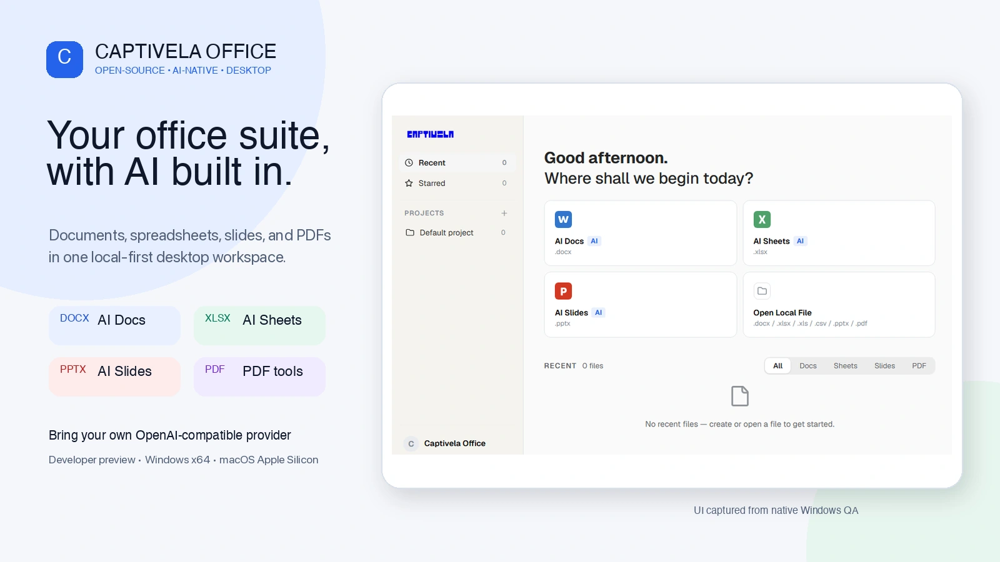
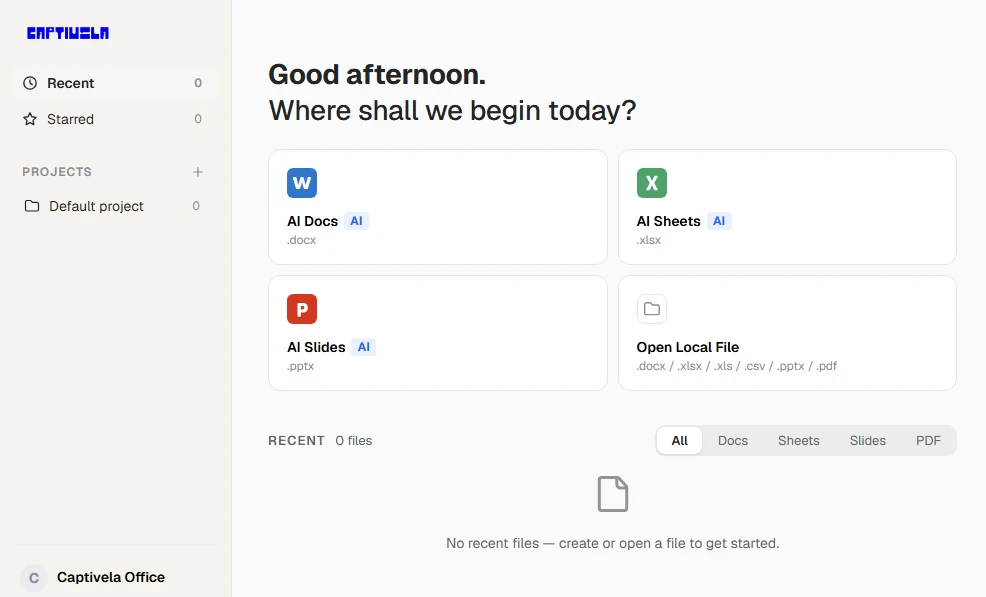
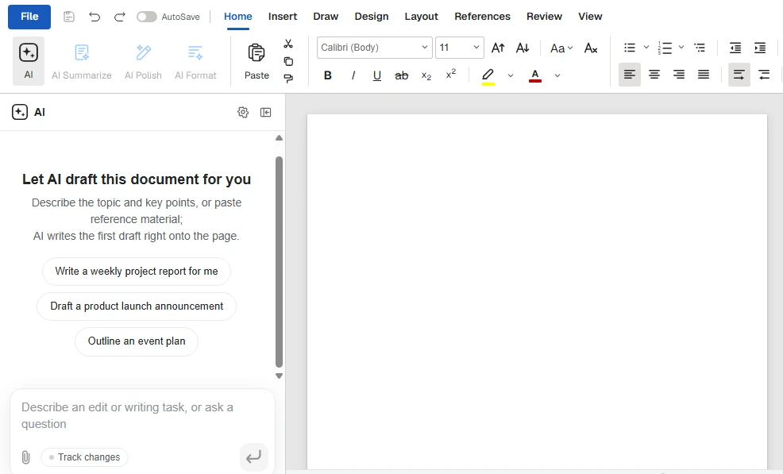
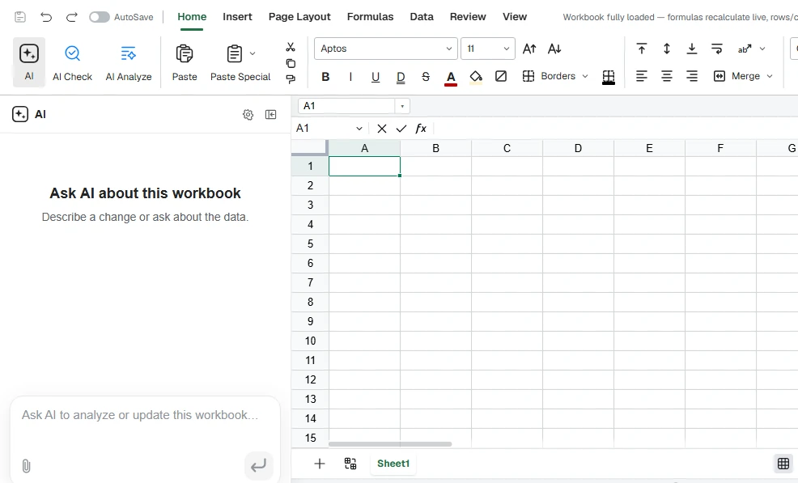
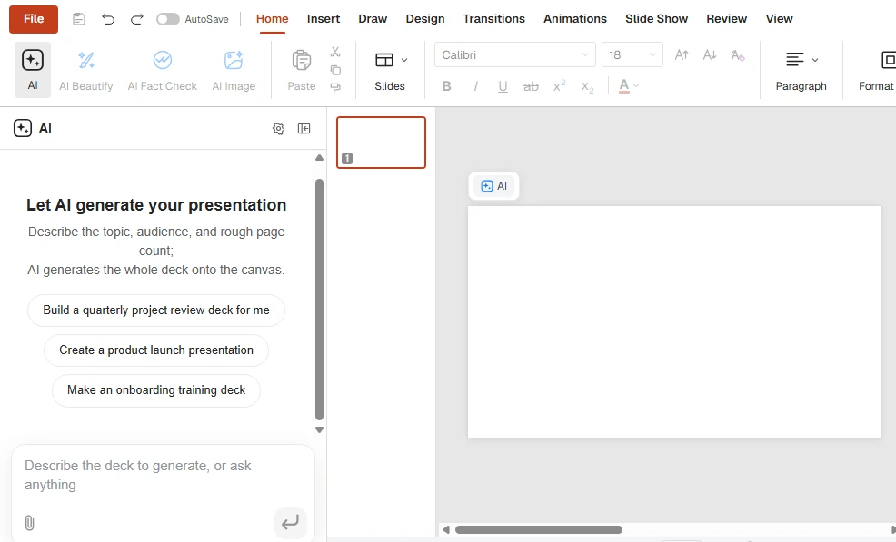
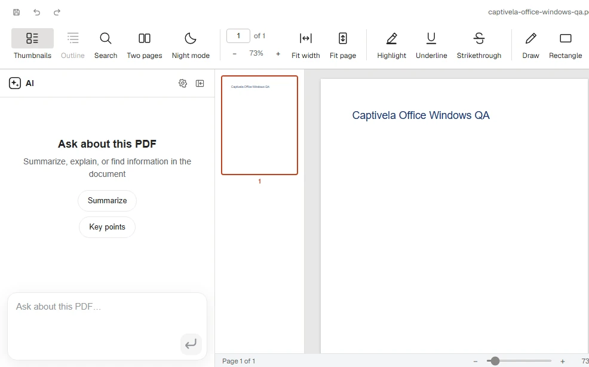

<div align="center">

# Captivela Office

**An open-source, AI-native desktop office suite for DOCX, XLSX/XLS/CSV, PPTX, and PDF files.**

[](https://github.com/bryanperdana/captivela-office/actions/workflows/ci.yml)
[](https://github.com/bryanperdana/captivela-office/actions/workflows/windows-build.yml)
[](LICENSE)
[](https://github.com/bryanperdana/captivela-office/releases/tag/v0.5.0)

[Download preview](#download-the-v050-preview) · [Installation guide](INSTALLATION.md) · [Contributing](CONTRIBUTING.md) · [Roadmap](ROADMAP.md)

</div>



## Download the v0.5.0 preview

<table>
<tr>
<td align="center"><strong>Windows x64</strong><br><a href="https://github.com/bryanperdana/captivela-office/releases/download/v0.5.0/Captivela%20Office%20Setup%200.5.0.exe">Download the .exe installer</a></td>
<td align="center"><strong>macOS Apple Silicon</strong><br><a href="https://github.com/bryanperdana/captivela-office/releases/download/v0.5.0/Captivela%20Office-0.5.0-arm64.dmg">Download the .dmg installer</a></td>
</tr>
</table>

> [!WARNING]
> **Unsigned developer preview.** v0.5.0 is for developers and technical early adopters, not a trusted consumer release. The Windows installer is not Authenticode-signed; the macOS app is not Developer ID-signed or notarized. Download only from the [v0.5.0 release page](https://github.com/bryanperdana/captivela-office/releases/tag/v0.5.0), verify its published SHA-256 checksum, and follow the narrowly scoped steps in [INSTALLATION.md](INSTALLATION.md). Do not disable Windows security or macOS Gatekeeper globally. The links above become active when the prerelease artifacts are published.

## Why Captivela Office

Captivela Office brings four familiar file workflows into one Electron desktop shell while letting you choose the OpenAI-compatible AI provider used by its assistant.

- **One desktop workspace:** open documents, workbooks, presentations, and PDFs from the same home screen and tabbed shell.
- **Format-aware editing:** the DOCX engine patches dirty paragraphs into the original OOXML archive; spreadsheet and presentation pipelines are designed around narrow edits and preservation of untouched file content.
- **Bring your own provider:** configure an OpenAI-compatible endpoint and model instead of depending on a Captivela-hosted AI account.
- **Explicit secret boundary:** API keys are encrypted with Electron `safeStorage`, resolved in the main process, and represented to renderer processes only by a stored-key marker.
- **Inspectable preview:** the source, packaging workflow, security posture, fork modifications, and third-party attribution are available in this repository.

Captivela Office works with local desktop files. Content sent to an AI feature is processed by the provider you configure, subject to that provider's terms and privacy policy; this is not an offline-only architecture.

## Actual app interface

These screenshots show the real Captivela Office application and editor interfaces captured during native Windows QA. The AI panels shown are editor states, not examples of generated output.

### Home



| Docs                                                             | Sheets                                                               |
| ---------------------------------------------------------------- | -------------------------------------------------------------------- |
|  |  |
| **Captivela Docs** — DOCX editor interface and AI panel.         | **Captivela Sheets** — spreadsheet editor interface and AI panel.    |

| Slides                                                               | PDF                                                            |
| -------------------------------------------------------------------- | -------------------------------------------------------------- |
|  |  |
| **Captivela Slides** — presentation editor interface and AI panel.   | **Captivela PDF** — PDF workspace and AI panel.                |

## Capabilities at a glance

| Workspace            | Formats                | Current preview scope                                                                                                                                    |
| -------------------- | ---------------------- | -------------------------------------------------------------------------------------------------------------------------------------------------------- |
| **Captivela Docs**   | DOCX                   | Paginated editing, styles, comments, tracked changes, equations, ink, and paragraph-level OOXML patching.                                                |
| **Captivela Sheets** | XLSX, XLS, CSV         | Workbook editing on the open-source Univer core, native Rust import/export sidecar, formulas, charts, pivot tables, slicers, and conditional formatting. |
| **Captivela Slides** | PPTX                   | In-repository parse/render/edit engine with masters, charts, cropping, ink, and text shaping.                                                            |
| **Captivela PDF**    | PDF                    | Viewing and editing with annotations, forms, outlines, stamps, signatures, page operations, and printing support.                                        |
| **AI assistant**     | OpenAI-compatible APIs | Shared AI panel, streaming, tool-calling workflows, custom instructions, and user-configured provider/model settings.                                    |

Compatibility varies with document complexity and the originating application. Keep backups of important files and report reproducible round-trip issues with a minimal, redacted sample.

## BYOK and security model

Fresh installs use the BYOK path: choose an OpenAI-compatible provider, enter its base URL, model, and API key, then test the connection. Loopback HTTP endpoints can support local development; non-loopback provider URLs must use HTTPS.

API keys are not hardcoded or passed through renderer chat requests. Electron's trusted main process encrypts stored keys with `safeStorage`, resolves them when making provider requests, and redacts secrets from errors returned across IPC. Renderer processes receive only a marker indicating whether a key exists.

The desktop windows use Electron renderer isolation (`contextIsolation: true`, `nodeIntegration: false`, `sandbox: true`), validated IPC, and gated external URLs. Read [SECURITY.md](SECURITY.md) for the complete threat model, binary trust status, and private reporting channel.

## Install as a user

1. Open the [v0.5.0 prerelease](https://github.com/bryanperdana/captivela-office/releases/tag/v0.5.0) and download the artifact for your platform.
2. Verify its SHA-256 checksum against the value published with the release.
3. Follow [INSTALLATION.md](INSTALLATION.md) for platform-specific installation and unsigned-app guidance.
4. Test with copies of your files while the project remains in developer preview.

## Developer quickstart

### Prerequisites

- Node.js 20 and npm 10 or newer
- Rust stable (`cargo` on `PATH`) for the Sheets XLSX sidecar
- Xcode Command Line Tools for macOS packaging
- Windows with the MSVC Rust target for an authoritative Windows x64 installer

```bash
git clone https://github.com/bryanperdana/captivela-office.git
cd captivela-office
npm ci
npm run fixtures
npm test
npm run typecheck
npm run dev
```

Useful commands:

```bash
npm run dev:docs    # run one editor
npm run build:all   # build all editors and the shell
npm run dist:mac    # package the macOS preview
npm run dist:win    # package the Windows preview
```

See [CONTRIBUTING.md](CONTRIBUTING.md) for the full validation matrix, Windows MSVC packaging contract, code conventions, and file-fidelity expectations.

## Architecture

The repository is an npm workspace:

- `apps/docs`, `apps/sheets`, `apps/slides`, `apps/pdf` — Electron editor applications.
- `apps/shell` — home screen and tabbed host for the four editors. Public auto-update stays disabled unless a release update URL is explicitly configured.
- `packages/docx-engine` — DOCX parsing, block anchors, OOXML fragment generation, and paragraph patching.
- `packages/pptx-engine`, `packages/pptx-render` — presentation model and rendering.
- `packages/file-parse` — text extraction for AI attachments.
- `packages/agent-core`, `packages/ai-provider` — shared agent loop, provider abstraction, and streaming.
- `packages/i18n`, `packages/ui`, `packages/project-store`, `packages/electron-utils` — shared localization, UI, recent-file storage, Electron helpers, and AI settings security.

### DOCX round trip

```text
open DOCX ─► archive original by hash
          ─► parse word/document.xml into anchored blocks
          ─► edit with dirty tracking
save      ─► dirty blocks become OOXML fragments
          ─► splice fragments into the original document.xml
          ─► repack while retaining untouched archive entries
```

Round-trip preservation is a core engineering goal, not a blanket compatibility guarantee. Changes to open/save code are expected to include fidelity tests.

## Roadmap and contributing

The immediate focus is safe preview distribution, file-format round-trip reliability, and compatibility. See [ROADMAP.md](ROADMAP.md) for the compact Now/Next/Later plan.

Issues and focused pull requests are welcome. Please search existing issues, use the repository templates, and read [CONTRIBUTING.md](CONTRIBUTING.md) and the [Code of Conduct](CODE_OF_CONDUCT.md) before participating. If this direction is useful to you, a GitHub star is a simple way to keep track of the project.

## Upstream, notices, and license

Captivela Office is a fork of [GenOffice](https://github.com/genspark-ai/genoffice). Fork history and material changes are recorded in [MODIFICATIONS.md](MODIFICATIONS.md), and the upstream [NOTICE](NOTICE) is preserved. `npm run notices` generates the bundled third-party license summary.

The open-source core is licensed under the [Apache License 2.0](LICENSE). The `ee/` directory is reserved for future enterprise modules and is covered by its [separate license](ee/LICENSE).

The GenOffice and Genspark names and logos are trademarks of Mainfunc, Inc. The Apache-2.0 license does not grant permission to use them; Captivela Office uses its own branding.
